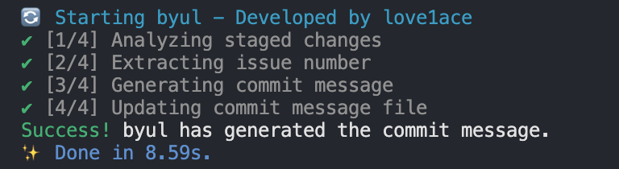

# byul

**byul**은 AI를 사용하여 브랜치 이름과 변경 사항(diff)을 기반으로 Git 커밋 메시지를 포맷하고 생성하는 도구입니다.


## Quick Start

빠르게 **byul**을 시작해보세요!

#### AI 모드 활성화

1. **설치**:

   ```bash
   npm install byul
   ```

2. **.env 설정**:

   ```bash
   OPENAI_API_KEY=your_openai_api_key
   ```

3. **커밋 사용**:
   ```bash
   git commit
   ```

#### AI 모드 비활성화

1. **설치**:

   ```bash
   npm install byul
   ```

2. **byul.config.json 설정**:

   ```json
   {
     "AI": false
   }
   ```

3. **커밋 사용**:
   ```bash
   git commit -m "commit message"
   ```

## Installation

선호하는 패키지 매니저를 사용하여 **byul**을 설치할 수 있습니다:

### npm

```bash
npm install byul
```

### Yarn

```bash
yarn add byul
```

### pnpm

```bash
pnpm add byul
```

### Bun

```bash
bun add byul
```

## Setup Error Resolution

`--save-dev` 옵션으로 설치한 후에도 `byul.config.json` 파일이 자동으로 생성되지 않는 경우, 이는 설정 스크립트가 개발 의존성 모드에서 자동으로 실행되지 않기 때문일 수 있습니다.

이를 해결하려면, 수동으로 설정 스크립트를 실행하세요:

```bash
node node_modules/byul/dist/setup.mjs
```

husky를 사용하고 있다면 아래의 설정 스크립트를 실행하세요:

`byul.config.json` 파일을 수동으로 생성하고 다음 코드를 추가할 수 있습니다:

```json
{
  "byulFormat": "{type}: {commitMessage} (#{issueNumber})",
  "AI": true,
  "language": "English",
  "model": "gpt-4o-mini",

  "commitTypes": {
    "feat": "Feature (new feature)",
    "fix": "Bug fix (bug fix)",
    "refactor": "Refactoring",
    "style": "Code style (code formatting, whitespace, comments, semicolons: no changes to business logic)",
    "docs": "Documentation (add, modify, delete docs, README)",
    "test": "Tests (add, modify, delete test code: no changes to business logic)",
    "settings": "Project settings",
    "chore": "Miscellaneous changes like package manager mods, e.g., .gitignore",
    "init": "Initial creation",
    "rename": "Rename or move files/folders only",
    "remove": "Delete files only",
    "design": "UI/UX design changes like CSS",
    "release": "Deployment or release, e.g., release/login-123"
  }
}
```

## Usage

`byul.config.json` 파일은 프로젝트의 루트 디렉토리에 배치해야 합니다.

```json
{
  "byulFormat": "{type}: {commitMessage} (#{issueNumber})", // AI 모드가 꺼져 있을 때 이 형식을 기반으로 커밋 메시지가 포맷됩니다.
  "AI": true, // AI 모드를 켜거나 끌 수 있습니다.

  // AI 모드가 활성화되었을 때 사용하는 설정입니다.
  "language": "English", // 언어 설정, 모든 언어를 지원합니다.
  "model": "gpt-4o-mini", // 모델 설정, 모든 ChatGPT 모델을 지원합니다.

  "commitTypes": {
    // 선택 사항, 프로젝트 요구에 맞게 구성할 수 있습니다.
    "feat": "Feature (new feature)",
    "fix": "Bug fix (bug fix)",
    "refactor": "Refactoring",
    "style": "Code style (code formatting, whitespace, comments, semicolons: no changes to business logic)",
    "docs": "Documentation (add, modify, delete docs, README)",
    "test": "Tests (add, modify, delete test code: no changes to business logic)",
    "settings": "Project settings",
    "chore": "Miscellaneous changes like package manager mods, e.g., .gitignore",
    "init": "Initial creation",
    "rename": "Rename or move files/folders only",
    "remove": "Delete files only",
    "design": "UI/UX design changes like CSS",
    "release": "Deployment or release, e.g., release/login-123"
  }
}
```

## AI 모드 활성화 (AI: true)

기본적으로, 영어 언어와 `gpt-4o-mini` 모델을 사용하는 것을 권장합니다.

```json
  "language": "English",
  "model": "gpt-4o-mini"
```

프로젝트의 루트 디렉토리에 `.env` 파일을 생성하고 다음과 같이 설정하세요:

```bash
OPENAI_API_KEY=your_openai_api_key
```

AI는 변경 사항을 자동으로 검토하고 `prepare-commit-msg` 훅을 사용하여 커밋 메시지를 작성합니다. **AI 모드는 `git commit` 명령어를 사용할 때만 작동합니다.** 커밋 메시지에 `-m` 옵션을 사용할 경우 작동하지 않습니다.

브랜치 이름에 이슈 번호가 포함되어 있으면, AI는 자동으로 이슈 번호를 커밋 메시지에 추가합니다. 또한, AI는 변경 사항을 검토하여 브랜치 이름과 관계없이 적절한 커밋 타입을 추가합니다.

```
feat: commit title (#123)

- commit body
- commit footer
```



## AI 모드 비활성화 (AI: false)

```json
  "byulFormat": "{type}: {commitMessage} (#{issueNumber})",
  "AI": false
```

`byul.config.json`에서 AI를 `false`로 설정하면, AI 자동 커밋 기능이 비활성화됩니다. 이 경우, 브랜치 이름을 기반으로 이슈 타입과 이슈 번호를 추출하여 커밋 메시지가 자동으로 포맷됩니다.

### 예제

브랜치 `feature/login-123`에서 다음과 같이 커밋하면:

```bash
git commit -m "Add login logic"
```

**byul**은 메시지를 다음과 같이 자동 포맷합니다:

```
feature: Add login logic #123
```

### 커스터마이징

`byul.config.json` 파일을 수정하여 커밋 메시지 형식을 사용자 정의할 수 있습니다. 예를 들어:

```json
{
  "byulFormat": "#{issueNumber} {commitMessage} ({type})"
}
```

동일한 브랜치 `feature/login-123`와 커밋 메시지:

```bash
git commit -m "Add login logic"
```

커밋 메시지는 다음과 같이 포맷됩니다:

```
#123 Add login logic (feature)
```

이러한 유연성을 통해 프로젝트의 요구에 가장 적합한 형식을 정의할 수 있습니다.

## FAQ

**Q. 커밋 메시지가 자동으로 포맷되지 않습니다.**

**A.** 브랜치 이름에 이슈 타입이나 이슈 번호가 포함되어 있지 않으면, 커밋 메시지가 자동으로 포맷되지 않습니다. 이슈 타입과 번호를 추출할 수 있는 형식을 브랜치 이름에 따라야 합니다.

**Q. AI 커밋 모드가 작동하지 않습니다.**

**A.** `.env` 파일에 `OPENAI_API_KEY키키가 포함되어 있는지 확인하세요. 이 키가 없으면 AI 모드가 작동하지 않습니다. 키를 추가하고 다시 시도하세요. 또는 유효하지 않는 `OPENAI_API_KEY키가 포함되어 있을 경우 커밋을 중단시킵니다.

**Q. 어떤 모델을 사용해야 하나요?**

**A.** 모든 ChatGPT 모델을 사용할 수 있지만, `gpt-4o-mini` 모델을 사용하는 것을 권장합니다.

**Q. 가끔은 byul 포맷팅 없이 커밋을 하고 싶습니다. 가능할까요?**

**A.** `.env` 파일에 `BYUL_ALL_OFF=true` 환경 변수를 추가해주시면 됩니다.

```env
BYUL_ALL_OFF=true
```

**Q. 저는 husky를 이용하고 있는데 byul이 아예 작동 하지 않는 것 같습니다.**

**A.** husky를 사용할 경우 훅스크립트 파일이 생성되지 않는 경우가 있습니다. 아래의 명령어를 복사해서 훅 스크립트를 추가해주세요.

```bash
echo 'node node_modules/byul/dist/index.js "$1" "$2" "$3"' > .husky/prepare-commit-msg
```

## Contributing

**byul**에 기여해 주셔서 감사합니다! 버그를 보고하거나, 개선 사항을 제안하거나, 풀 리퀘스트를 제출하는 등, 여러분의 참여를 환영합니다.

## License

이 프로젝트는 MIT 라이선스 하에 배포됩니다. 자세한 내용은 [LICENSE](LICENSE) 파일을 참조하세요.

## Contact

질문, 제안 또는 피드백이 있으시면 [love1ace](mailto:lovelacedud@gmail.com)로 연락해 주세요.
