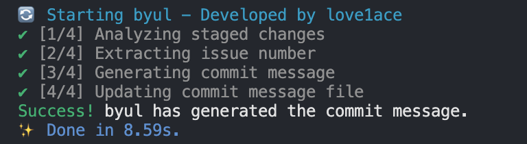

# byul

**byul** is a tool that uses AI to format and generate Git commit messages based on branch names and diffs.


## Quick Start

Get **byul** up and running quickly!

#### AI Mode

1. **Install**:
    ```bash
    npm install byul
    ```

2. **Set Up .env**:
    ```bash
    OPENAI_API_KEY=your_openai_api_key
    ```

3. **Use Commit**:
    ```bash
    git commit
    ```

#### AI Mode Disabled

1. **Install**:
    ```bash
    npm install byul
    ```

2. **Configure byul.config.json**:
    ```json
    {
        "AI": false
    }
    ```

3. **Use Commit**:
    ```bash
    git commit -m "commit message"
    ```

## Installation

You can install **byul** using your preferred package manager:

### npm

```bash
npm install byul
```

### Yarn

```bash
yarn add byul
```

### pnpm

```bash
pnpm add byul
```

### Bun

```bash
bun add byul
```

## Setup Error Resolution

If the `byul.config.json` file hasn’t been created automatically after installing with `--save-dev`, it may be because the setup script doesn't run automatically in development dependency mode.

To resolve this, manually run the setup script:

```bash
node node_modules/byul/dist/setup.mjs
```

## Usage

The `byul.config.json` file must be placed in the root directory of your project.

```json
{
  "byulFormat": "{type}: {commitMessage} (#{issueNumber})", // Commit message is formatted based on this when AI mode is off.
  "AI": true, // Toggle AI mode on or off.

  // The following settings are used when AI mode is enabled.
  "language": "English", // Language setting, all languages are supported.
  "model": "gpt-4o-mini", // Model setting, all ChatGPT models are supported.

  "commitTypes": { // Optional, configure as per the project needs.
    "feat": "Feature (new feature)",
    "fix": "Bug fix (bug fix)",
    "refactor": "Refactoring",
    "style": "Code style (code formatting, whitespace, comments, semicolons: no changes to business logic)",
    "docs": "Documentation (add, modify, delete docs, README)",
    "test": "Tests (add, modify, delete test code: no changes to business logic)",
    "settings": "Project settings",
    "chore": "Miscellaneous changes like package manager mods, e.g., .gitignore",
    "init": "Initial creation",
    "rename": "Rename or move files/folders only",
    "remove": "Delete files only",
    "design": "UI/UX design changes like CSS",
    "release": "Deployment or release, e.g., release/login-123"
  }
}
```

## AI Mode Enabled (AI: true)

By default, we recommend using the English language and the `gpt-4o-mini` model.

```json
  "language": "English",
  "model": "gpt-4o-mini"
```

Create a `.env` file in the root directory of your project and set it as follows:

```bash
OPENAI_API_KEY=your_openai_api_key
```

AI will automatically review the changes in the diff and use the `prepare-commit-msg` hook to write the commit message. **Note that AI mode only works when using the `git commit` command.** It won't work when using the `-m` option for commit messages.

If an issue number is included in the branch name, AI will automatically append the issue number to the commit message. AI will also review the changes and append the appropriate commit type, regardless of the branch name.

```
feat: commit title (#123)

- commit body
- commit footer
```



## AI Mode Disabled (AI: false)

```json
  "byulFormat": "{type}: {commitMessage} (#{issueNumber})",
  "AI": false
```

When AI is set to `false` in `byul.config.json`, the AI auto-commit feature is disabled. In this case, commit messages will automatically be formatted based on the branch name, extracting the issue type and issue number.

### Example

Given the branch `feature/login-123`, if you commit with:

```bash
git commit -m "Add login logic"
```

**byul** will automatically format the message as:

```
feature: Add login logic #123
```

### Customization

You can customize the commit message format by modifying the `byul.config.json` file. For example:

```json
{
  "byulFormat": "#{issueNumber} {commitMessage} ({type})"
}
```

Given the same branch `feature/login-123` and commit message:

```bash
git commit -m "Add login logic"
```

The commit message will be formatted as:

```
#123 Add login logic (feature)
```

This flexibility allows you to define a format that best suits your project's needs.


## FAQ

**Q. The commit message is not automatically formatted.**

**A.** If the branch name doesn't include the issue type or issue number, the commit message won't be automatically formatted. Ensure the branch name follows the format that allows extraction of the issue type and number.

**Q. AI commit mode is not working.**

**A.** Ensure that the `.env` file includes the `OPENAI_API_KEY`. Without this key, the AI mode won't function. Add the key and try again.

**Q. Which model should I use?**

**A.** Any ChatGPT model can be used, but we recommend using the `gpt-4o-mini` model.

**Q. The project path has changed, and byul is no longer working.**

**A.** If the project path changes, byul may stop functioning correctly. To resolve this, delete the `.git/hooks/prepare-commit-msg` file and run the `setup.mjs` script again:

```bash
node node_modules/byul/dist/setup.mjs
```

If you are using Husky, delete the `.husky/_/prepare-commit-msg` file and run the `setup.mjs` script again:

```bash
node node_modules/byul/dist/setup.mjs
```

## Contributing

We welcome contributions to **byul**! Whether it's reporting a bug, suggesting an enhancement, or submitting a pull request, your input is valued.

## License

This project is licensed under the MIT License - see the [LICENSE](LICENSE) file for details.

## Contact

For any questions, suggestions, or feedback, please contact [love1ace](mailto:lovelacedud@gmail.com).