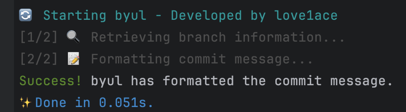

# byul

**byul**은 브랜치 이름을 기반으로 Git 커밋 메시지를 자동으로 일관성 있게 유지하는 패키지입니다.


### [영어](README.md) | [한국어](README_KO.md)

## 1. 🚀 설치

**byul**을 설치하는 방법은 다음과 같습니다:

### Npm

```bash
npm install byul
npx husky add .husky/commit-msg 'node ./node_modules/byul/dist/index.js "$1"'
```

### Yarn

```bash
yarn add byul
yarn husky add .husky/commit-msg 'node ./node_modules/byul/dist/index.js "$1"'
```

### Yarn Berry
```bash
yarn add byul
yarn dlx husky-init --yarn2 && yarn install
yarn dlx husky add .husky/commit-msg 'yarn node ./byul/dist/index.js "$1"'
```

### Pnpm

```bash
pnpm add byul
pnpm husky add .husky/commit-msg 'node ./node_modules/byul/dist/index.js "$1"'
```

### Npx (Temporary Usage)

```bash
npx byul
npx husky add .husky/commit-msg 'node ./node_modules/byul/dist/index.js "$1"'
```

## 2. ✨ 주요 기능

**byul**이 제공하는 주요 기능은 다음과 같습니다:

- **커밋 메시지 포맷팅**: 브랜치 이름을 기반으로 커밋 메시지를 자동으로 포맷하여 일관성을 유지합니다.
- **Husky 연동**: 추가 설정 없이 Husky와 쉽게 통합되어 커밋 메시지 포맷팅을 자동화합니다.
- **사용자 정의 가능**: 사용자 정의 브랜치 이름 규칙을 지원합니다.
- **호환성**: 기존에 `commit-msg` 훅이 있는 경우, **byul**기능을 덧붙여 현재 워크플로우를 방해하지 않습니다.

## 3. 🔧 Husky 연동

**byul**은 [Husky](https://github.com/typicode/husky)와 원활하게 연동되어 Git 훅 설정을 자동화합니다. 설치 후, Husky는 커밋 프로세스 중에 **byul**을 자동으로 실행하여 메시지를 포맷합니다.

### SetupHooks.js

Git 훅은 설치 과정에서 실행되는 `setupHooks.cjs` 스크립트를 통해 설정됩니다. 이 스크립트는 기존의 `commit-msg` 훅이 있는 경우에도 **byul**이 프로젝트 워크플로우에 올바르게 통합되도록 합니다.

## 4. 🛠️ 권장 브랜치 이름 규칙

**byul**의 기능을 극대화하려면 다음과 같은 브랜치 이름 규칙을 사용하는 것이 좋습니다:

- **type/issue**: 새로운 기능 개발 (예: `feature/123-login`, `feature/login-123`, 또는 `feature/login123`)

**byul**은 이러한 규칙을 기반으로 브랜치 유형과 이슈 번호(있을 경우)를 추출하여 커밋 메시지를 포맷합니다.

### 지원되지 않는 브랜치 이름 규칙

권장되는 형식을 따르지 않는 브랜치 이름은 **byul**과 함께 올바르게 작동하지 않을 수 있습니다. 예시:

- `release/release-1.0.2`
- `develop/develop3-132`

## 5. ⚙️ 작동 원리

Git에서 변경 사항을 커밋할 때, **byul**은 다음 단계를 통해 커밋 메시지를 자동으로 포맷합니다:

1. **브랜치 이름 조회**: **byul**이 현재 브랜치 이름을 가져옵니다.
2. **커밋 메시지 포맷팅**: 커밋 메시지는 브랜치 유형(예: `feature:`)으로 접두어가 추가되고, 이슈 번호가 있을 경우 접미어로 추가됩니다.
3. **기존 훅과의 통합**: 기존에 `commit-msg` 훅이 있는 경우, **byul**은 그 기능을 덧붙여 원활하게 통합됩니다.

### 예시

`feature/login-123` 브랜치에서 다음과 같이 커밋하는 경우:

```bash
git commit -m "로그인 로직 추가"
```

**byul**은 메시지를 자동으로 다음과 같이 포맷합니다:

```
feature: 로그인 로직 추가 #123
```


## 6. 🤝 기여 방법

**byul**에 대한 기여는 언제나 환영합니다! 버그 리포팅, 기능 제안, 풀 리퀘스트 제출 등 다양한 형태의 기여가 가능합니다.

### 기여 방법:

1. GitHub에서 레포지토리를 포크하세요.
2. `main` 브랜치에서 새로운 브랜치를 만드세요(예: `git checkout -b feature/my-feature`).
3. 변경 사항을 구현하세요.
4. **byul**의 커밋 규칙을 따르며 변경 사항을 커밋하세요.
5. 브랜치를 푸시하세요(`git push origin feature/my-feature`).
6. `main` 브랜치에 대한 풀 리퀘스트를 여세요.

## 📜 라이선스

이 프로젝트는 MIT 라이선스에 따라 라이선스가 부여됩니다 - 자세한 내용은 [LICENSE](LICENSE) 파일을 참조하세요.

## 📞 연락처

질문, 제안 또는 피드백이 있으시면 [love1ace](mailto:lovelacedud@gmail.com)에게 연락주세요.

## ❓ FAQ

### 왜 제 커밋 메시지가 포맷되지 않나요?

브랜치가 권장되는 이름 규칙(예: `feature/`, `bugfix/`)을 따르고 있는지 확인하세요. 또한 **byul**이 제대로 설치되었고, 프로젝트에서 Husky가 올바르게 설정되었는지 확인하세요.

### 브랜치 이름 규칙을 어떻게 사용자 정의할 수 있나요?

브랜치 이름 규칙은 **byul**의 설정에서 직접 수정할 수 있습니다. 자세한 내용은 문서를 참조하세요.
